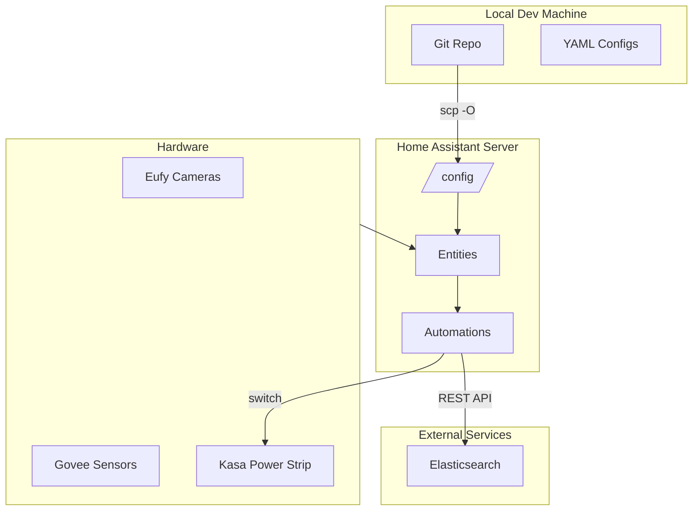

# Agent Onboarding Guide

This document helps AI agents quickly understand the Sproutie Outie Control project.

---

## 1. Project Overview

**Sproutie Outie Control** is a Home Assistant-based automation system for a microgreens grow tent.

- **Controls:** Grow lights, circulation fans, exhaust fan, camera flash
- **Monitors:** Temperature, humidity, VPD (calculated)
- **Tracks:** Crop batches across 16 slots (A1-A8 top rack, B1-B8 bottom rack)
- **Logs:** Events and telemetry to Elasticsearch

---

## 2. Hardware

| Component | Details |
|-----------|---------|
| **Cameras** | 2x Eufy cameras (`camera.top_eyes_snapshot`, `camera.bottom_eyes_snapshot`) |
| **Sensors** | Govee temp/humidity: `sensor.monitor2_*` (single sensor inside tent - covers both racks), `sensor.govee_humidity_temp_monitor_*` (room - NOT used for exhaust automation) |
| **Power** | Kasa/TP-Link 6-port smart strip - controls all switches and reports power consumption |

**Switch Entities:**
- `switch.top_shelf_lights` / `switch.bottom_shelf_lights`
- `switch.top_shelf_fan` / `switch.bottom_shelf_fan`
- `switch.exhaust_fan`
- `switch.camera_flash`

---

## 3. Critical Rules

**DO NOT VIOLATE THESE:**

1. **Always deploy to HA server** - Local edits mean nothing until deployed
2. **Never commit until user confirms working** - Test on live system first
3. **Check `git status` before changes** - Understand what's already modified

---

## 4. Architecture



---

## 5. Key Files

| File | Purpose |
|------|---------|
| `configuration.yaml` | Main HA config, dashboard definitions |
| `ui-lovelace-v3.yaml` | **Primary dashboard - DO NOT BREAK** |
| `packages/sproutie_outie/scripts.yaml` | All automation scripts |
| `packages/sproutie_outie/helpers.yaml` | Input entities (slots, settings) |
| `packages/sproutie_outie/automations.yaml` | Triggered automations |
| `packages/sproutie_outie/sensors.yaml` | Template sensors, REST sensors |
| `rest_commands.yaml` | Elasticsearch REST calls |
| `secrets.yaml` | ES credentials (**not in repo** - check `/config/secrets.yaml` on server) |

---

## 6. Deployment

**HA Server:** `kegsofduff@192.168.1.232`
**Config path:** `/config/`

### Primary Method (scp -O)
```bash
scp -O <local-file> kegsofduff@192.168.1.232:/config/<path>
```

### Backup Method (SSH + sudo tee)
```bash
cat <local-file> | ssh kegsofduff@192.168.1.232 "sudo tee /config/<path> > /dev/null"
```

### After Deployment
User must either:
- Developer Tools → YAML → Reload specific config (Scripts, Automations, etc.)
- Or full restart: Settings → System → Restart

---

## 7. Data Model

### Slot Data
- Stored in `input_text.slot_[a-b][1-8]_data` as minified JSON
- **255 character limit** - JSON must be compact
- Example: `{"crop":"Sunflower","id":"1768878531","planted":"2026-01-19","phase":"Blackout","container":"Tray","seed_weight":150,"history":[]}`

### Batch Concept
- A **Batch ID** links 8 slots together (one crop planting across a full rack)
- A1-A8 share one batch ID (top rack)
- B1-B8 share another batch ID (bottom rack)

### Rack Mapping
| Slots | Rack | Camera |
|-------|------|--------|
| A1-A8 | Top | `camera.top_eyes_snapshot` |
| B1-B8 | Bottom | `camera.bottom_eyes_snapshot` |

**Note:** There is only ONE temp/humidity sensor inside the tent (`sensor.monitor2_*`) which covers both racks. The room sensor (`sensor.govee_humidity_temp_monitor_*`) is NOT inside the tent.

### Elasticsearch Indices
- `sproutie-events-*` - Crop events (watering, phase changes, notes)
- `sproutie-sensors-*` - Telemetry data (temp, humidity, power)

ES credentials are in `/config/secrets.yaml` on the server (`elastic_url`, `es_api_key`).

---

## 8. Domain Knowledge

### Phase Progression
```
Germination → Blackout → Growing → Harvest
```

### Crop Library
Stored in `input_text.crop_library_json`. Contains `grow_days` per crop type for calculating harvest dates.

---

## 9. Known Issues

### Slot Data Corruption
Something occasionally triggers phase changes that wipe crop names to "Unknown" and clear planted dates.

**Repair Method:**
1. Create temporary script in `packages/sproutie_outie/repair_slots.yaml`
2. Deploy to server
3. Reload scripts
4. Run via Developer Tools → Services
5. Delete repair script after confirming fix

---

## 10. Technical Gotchas

| Issue | Solution |
|-------|----------|
| **Jinja2 loops** | Use `namespace()` for mutable variables: `` |
| **Safe access** | Always use `\| default()` or `.get()` for optional values |
| **255 char limit** | `input_text` max length - minify JSON, omit empty fields |
| **YAML errors** | Almost always indentation - validate before deploying |
| **Template syntax** | Lovelace: `{{ }}`, auto-entities templates return JSON arrays |

---

## 11. Debugging

| Method | When to Use |
|--------|-------------|
| `system_log.write` | Add debug logging to scripts/automations |
| `persistent_notification.create` | Visible popup for debug output |
| Elasticsearch | Check `sproutie-events-*` in Kibana |
| Developer Tools → States | Inspect current entity values |
| Developer Tools → Services | Test service calls manually |

---

## 12. Git Workflow

1. Make changes locally
2. Deploy to HA server
3. User tests on live system
4. **Only commit after user confirms working**
5. Keep commits atomic and descriptive
6. Never force push to main

---

## 13. User Preferences

- **Direct answers** - No fluff or unnecessary explanation
- **Systematic debugging** - Don't make snap guesses; gather evidence first
- **Ask before committing** - Deploys are fine, commits need approval
- **Check git first** - When things break, `git diff` to see what changed
