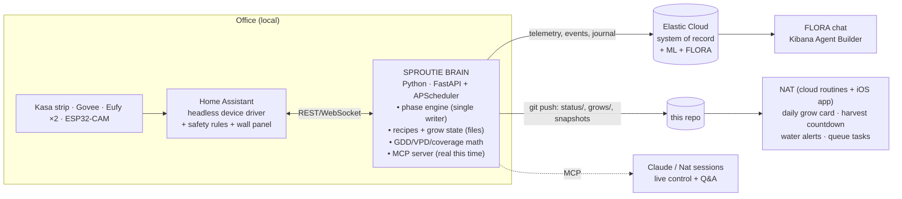

# 02 — Proposal B: Headless HA + Sproutie Brain + Nat as the UI ★ recommended

The insight from three abandoned dashboards: the problem was never the theme, it's that
**Lovelace was asked to be an app**. And the insight from the repo survey: you already started
building the right thing — `mcp_server/` is a stub of exactly the component this architecture
needs. It just needs to become real and take the state with it.

## B1 — The recommended shape

**Each component does the one thing it's best at:**

- **HA (demoted, per 01's Laws):** device I/O, dumb schedules, safety rules, and *one*
  generated wall-panel dashboard for glancing at the tent from the desk. No grow logic, no
  helpers-as-database, no mobile UI. HA becomes a component you could swap — and therefore
  never need to.
- **Sproutie Brain (new, ~500 lines to MVP):** a small always-on Python service (runs on the
  HA box or any Pi). Owns `recipes/`, `state/grows.yaml`, the phase engine, and all agronomy
  math (03). Talks to HA over its WebSocket/REST API. Exposes:
  - **MCP server** — the existing stub's tool surface (`get_tent_status`, `set_fan_state`,
    `advance_phase`, …) implemented for real. FLORA's workflow tools point here and finally
    work; Claude sessions and Nat get the same hands.
  - **REST** — for the wall panel and any future thin UI.
- **Elastic Cloud (kept, promoted):** already the system of record. Brain ships telemetry,
  events, and the grow journal; the anomaly ML job and the dormant botany-log semantic search
  come back to life with a real writer. Kibana = the deep-analysis UI; you get "how did this
  grow compare to the last five" as an ES|QL query, and it's work-tech you actually enjoy.
- **Nat (the phone/daily UI you were never going to get from Lovelace):** the Brain
  `git push`es a compact `status/tent.yaml` + latest snapshot JPEGs to this repo on change +
  daily. Nat's existing cloud routines read the repo (same trick as `brain.md`) and emit a
  **grow card into the daily cards system** — harvest countdowns, "water rack-top (−180 g)",
  mold-risk warnings — with photo. Mark-done flows back through nat's existing
  `today-actions.yaml` reconciliation. Zero new infrastructure on the Nat side; the tent
  becomes another organ of a body that already exists. Asking "how are the sprouts?" in the
  Nat app returns the card + snapshot; asking it to skip a light cycle goes MCP → Brain → HA.
- **FLORA (kept, for joy):** the resident botanist persona lives in Kibana with real ES|QL
  tools and — now — a working control path via the Brain's MCP. FLORA is the tent's voice;
  Fischoeder (05§1) is its landlord; Nat is the chief of staff. The org chart is complete.

**Why git as the home↔cloud bridge:** no ports opened, no Nabu Casa dependency for the daily
loop, versioned state for free, and it's the exact pattern nat already runs on. (Keep Nabu
Casa or Tailscale as the *live-control* path for MCP when away from home; the daily-status
loop should never depend on it.)

### Failure modes, designed-in
- Internet down → HA + Brain keep growing locally (schedules, exhaust, photos queue); Nat
  card goes stale with a "last seen" stamp instead of lying.
- Brain down → HA safety rules + dumb schedules keep plants alive; watchdog alert fires.
- HA down → (post-hardware-migration) ESPHome on-device safety still guards heat; Brain
  alerts.
- Plants uninterested in your architecture → grow anyway.

## B2 — The full custom stack (no HA), for the record

Mosquitto MQTT bus + Zigbee2MQTT + ESPHome-native devices, Brain does everything HA did,
Frigate for cameras, custom PWA. **Honest assessment:** you'd rebuild device drivers HA gives
you free (Kasa, Eufy, Govee integrations), lose the escape hatches (HA app, voice pipeline,
3,000 integrations for whatever you buy next), and gain… the absence of a component that, in
B1, you barely touch. B2 is the right call only if the *rebuilding itself* is the fun you're
after, or if HA-the-project ever rots. **B1 with 01's laws makes HA small enough that B2
stays a weekend exit ramp forever. That's the strategic position: earn the exit, don't take
it.**

## Decision matrix

| | A (HA fixed) | **B1 (headless HA + Brain)** | B2 (no HA) |
|---|---|---|---|
| Stops the breakage | ✅ | ✅ | ✅ |
| Phone UI you'll actually use | ❌ HA app | ✅ **Nat** | ⚠️ build a PWA |
| FLORA gets real hands | ❌ | ✅ | ✅ |
| Predictive layer (03) has a home | ⚠️ PyScript, awkward | ✅ Brain, natural | ✅ |
| Scales to tent #2 / yard / pots | ⚠️ | ✅ zones in config | ✅ |
| New code to write | ~0 | ~500-line service + bridge | ~5× that |
| Uses what you already built | most | **all of it** (ES, FLORA, mcp_server stub, GCP pipeline) | some |

**Recommendation: B1.** It is Proposal A's laws + one small service you already stubbed +
the Nat bridge — and it's the only option where the answer to "which UI?" is "the assistant
you already built and actually like."
